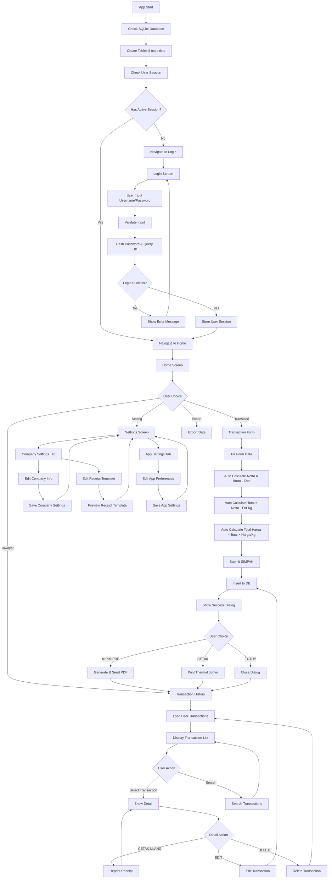

# SQLite Database Design & Flow Guide
## Aplikasi Timbangan RAM SEKAWAN JAYA SEJAHTERA

### Database Schema

#### 1. Tabel Users
```sql
CREATE TABLE users (
    id INTEGER PRIMARY KEY AUTOINCREMENT,
    username VARCHAR(50) UNIQUE NOT NULL,
    password VARCHAR(255) NOT NULL, -- Hashed password
    full_name VARCHAR(100),
    created_at DATETIME DEFAULT CURRENT_TIMESTAMP,
    updated_at DATETIME DEFAULT CURRENT_TIMESTAMP
);
```

#### 2. Tabel Transactions
```sql
CREATE TABLE transactions (
    id INTEGER PRIMARY KEY AUTOINCREMENT,
    user_id INTEGER NOT NULL,
    transaction_date DATE NOT NULL,
    
    -- Data Barang
    jenis_barang VARCHAR(100) NOT NULL,
    
    -- Data Timbangan
    bruto_kg DECIMAL(10,2) NOT NULL,
    tare_kg DECIMAL(10,2) NOT NULL,
    netto_kg DECIMAL(10,2) NOT NULL,
    
    -- Data Harga
    pot_percentage DECIMAL(5,2) DEFAULT 0, -- Potongan dalam persen
    pot_kg DECIMAL(10,2) DEFAULT 0, -- Potongan dalam kg
    harga_per_kg DECIMAL(15,2) NOT NULL,
    total_kg DECIMAL(10,2) NOT NULL, -- Netto - Pot(Kg)
    total_harga DECIMAL(15,2) NOT NULL,
    
    -- Data Admin & Customer
    admin_name VARCHAR(100) NOT NULL,
    customer_name VARCHAR(100) NOT NULL,
    
    -- Alamat & Kontak
    alamat TEXT,
    phone VARCHAR(20),
    
    -- Catatan
    catatan TEXT,
    
    -- Metadata
    created_at DATETIME DEFAULT CURRENT_TIMESTAMP,
    updated_at DATETIME DEFAULT CURRENT_TIMESTAMP,
    
    FOREIGN KEY (user_id) REFERENCES users(id) ON DELETE CASCADE
);
```

#### 3. Tabel Company Settings (untuk kustomisasi thermal receipt)
```sql
CREATE TABLE company_settings (
    id INTEGER PRIMARY KEY AUTOINCREMENT,
    user_id INTEGER NOT NULL,
    
    -- Header Information
    company_name VARCHAR(100) DEFAULT 'RAM SEKAWAN JAYA SEJAHTERA',
    company_address TEXT DEFAULT 'Kelurahan Sari Bungamas Lahat',
    company_phone VARCHAR(20) DEFAULT '0813 7779 0785',
    company_phone_label VARCHAR(20) DEFAULT '(manual)',
    
    -- Footer Information
    footer_text TEXT DEFAULT 'Terima Kasih',
    show_admin BOOLEAN DEFAULT 1,
    show_customer BOOLEAN DEFAULT 1,
    show_notes BOOLEAN DEFAULT 1,
    
    -- Receipt Layout
    paper_width INTEGER DEFAULT 58, -- 58mm thermal
    font_size_header INTEGER DEFAULT 12,
    font_size_body INTEGER DEFAULT 10,
    font_size_footer INTEGER DEFAULT 10,
    
    -- Separator Lines
    use_separator_lines BOOLEAN DEFAULT 1,
    separator_char VARCHAR(5) DEFAULT '-',
    
    -- Date Format
    date_format VARCHAR(20) DEFAULT 'DD/MM/YYYY',
    show_time BOOLEAN DEFAULT 0,
    
    -- Number Format
    decimal_places INTEGER DEFAULT 0,
    thousand_separator VARCHAR(5) DEFAULT '.',
    decimal_separator VARCHAR(5) DEFAULT ',',
    currency_symbol VARCHAR(10) DEFAULT 'Rp',
    
    created_at DATETIME DEFAULT CURRENT_TIMESTAMP,
    updated_at DATETIME DEFAULT CURRENT_TIMESTAMP,
    
    FOREIGN KEY (user_id) REFERENCES users(id) ON DELETE CASCADE
);
```

#### 4. Tabel App Settings (untuk pengaturan aplikasi umum)
```sql
CREATE TABLE app_settings (
    id INTEGER PRIMARY KEY AUTOINCREMENT,
    user_id INTEGER,
    setting_key VARCHAR(50) NOT NULL,
    setting_value TEXT,
    created_at DATETIME DEFAULT CURRENT_TIMESTAMP,
    updated_at DATETIME DEFAULT CURRENT_TIMESTAMP,
    
    FOREIGN KEY (user_id) REFERENCES users(id) ON DELETE CASCADE,
    UNIQUE(user_id, setting_key)
);
```

#### 5. Indexes untuk Performance
```sql
-- Index untuk pencarian transaksi berdasarkan user
CREATE INDEX idx_transactions_user_id ON transactions(user_id);

-- Index untuk pencarian berdasarkan tanggal
CREATE INDEX idx_transactions_date ON transactions(transaction_date);

-- Index untuk pencarian berdasarkan customer
CREATE INDEX idx_transactions_customer ON transactions(customer_name);

-- Index untuk username (login)
CREATE INDEX idx_users_username ON users(username);

-- Index untuk company settings
CREATE INDEX idx_company_settings_user_id ON company_settings(user_id);
```

### Database Operations

#### 1. User Management
```sql
-- Register User
INSERT INTO users (username, password, full_name) 
VALUES (?, ?, ?);

-- Login Verification
SELECT id, username, full_name 
FROM users 
WHERE username = ? AND password = ?;

-- Update User Profile
UPDATE users 
SET full_name = ?, updated_at = CURRENT_TIMESTAMP 
WHERE id = ?;
```

#### 2. Transaction Operations
```sql

#### 3. Company Settings Operations
```sql
-- Create Default Company Settings (saat user pertama kali register)
INSERT INTO company_settings (
    user_id, company_name, company_address, company_phone, company_phone_label
) VALUES (?, 'RAM SEKAWAN JAYA SEJAHTERA', 'Kelurahan Sari Bungamas Lahat', '0813 7779 0785', '(manual)');

-- Get Company Settings for User
SELECT * FROM company_settings WHERE user_id = ?;

-- Update Company Settings
UPDATE company_settings 
SET company_name = ?, company_address = ?, company_phone = ?, 
    company_phone_label = ?, footer_text = ?, paper_width = ?, 
    font_size_header = ?, font_size_body = ?, date_format = ?, 
    decimal_places = ?, thousand_separator = ?, decimal_separator = ?, 
    currency_symbol = ?, updated_at = CURRENT_TIMESTAMP
WHERE user_id = ?;

-- Get Thermal Receipt Template Data (untuk cetak)
SELECT 
    cs.*,
    t.transaction_date, t.jenis_barang, t.bruto_kg, t.tare_kg, 
    t.netto_kg, t.pot_percentage, t.pot_kg, t.total_kg, 
    t.harga_per_kg, t.total_harga, t.admin_name, t.customer_name, 
    t.alamat, t.phone, t.catatan
FROM company_settings cs
JOIN transactions t ON cs.user_id = t.user_id
WHERE t.id = ? AND t.user_id = ?;
```

#### 4. App Settings Operations
```sql
-- Insert New Transaction
INSERT INTO transactions (
    user_id, transaction_date, jenis_barang, bruto_kg, tare_kg, 
    netto_kg, pot_percentage, pot_kg, harga_per_kg, total_kg, 
    total_harga, admin_name, customer_name, alamat, phone, catatan
) VALUES (?, ?, ?, ?, ?, ?, ?, ?, ?, ?, ?, ?, ?, ?, ?, ?);

-- Get User Transactions (Latest First)
SELECT * FROM transactions 
WHERE user_id = ? 
ORDER BY created_at DESC, id DESC;

-- Get Transaction by ID
SELECT * FROM transactions 
WHERE id = ? AND user_id = ?;

-- Search Transactions
SELECT * FROM transactions 
WHERE user_id = ? 
AND (customer_name LIKE ? OR jenis_barang LIKE ?)
ORDER BY created_at DESC;

-- Update Transaction
UPDATE transactions 
SET jenis_barang = ?, bruto_kg = ?, tare_kg = ?, netto_kg = ?, 
    pot_percentage = ?, pot_kg = ?, harga_per_kg = ?, total_kg = ?, 
    total_harga = ?, admin_name = ?, customer_name = ?, alamat = ?, 
    phone = ?, catatan = ?, updated_at = CURRENT_TIMESTAMP
WHERE id = ? AND user_id = ?;

-- Delete Transaction
-- Get App Setting by Key
SELECT setting_value FROM app_settings 
WHERE user_id = ? AND setting_key = ?;

-- Set App Setting
INSERT OR REPLACE INTO app_settings (user_id, setting_key, setting_value, updated_at) 
VALUES (?, ?, ?, CURRENT_TIMESTAMP);

-- Get All App Settings for User
SELECT setting_key, setting_value FROM app_settings 
WHERE user_id = ?;
```

### Thermal Receipt Template System

#### Template Structure
```
================================
     {company_name}
    {company_address}
     HP: {company_phone} {phone_label}
================================

Tanggal    : {formatted_date}
Barang     : {jenis_barang}  
Bruto      : {bruto_kg} Kg
Tare       : {tare_kg} Kg
Netto      : {netto_kg} Kg
Pot (%)    : {pot_percentage}%
Pot (Rp)   : {pot_kg} Kg
Total      : {total_kg} Kg
Harga      : {currency_symbol} {formatted_price}
Jumlah Uang: {currency_symbol} {formatted_total}

--------------------------------

Admin        : {admin_name}
Customer/Sopir: {customer_name}

--------------------------------
        {footer_text}

Catatan:
{catatan}
```

#### Customizable Elements
1. **Header Section:**
   - Company Name
   - Company Address  
   - Phone & Label

2. **Content Formatting:**
   - Date Format (DD/MM/YYYY, MM/DD/YYYY, etc.)
   - Number Format (decimal places, thousand separator)
   - Currency Symbol

3. **Layout Options:**
   - Paper Width (58mm, 80mm)
   - Font Sizes
   - Show/Hide Admin
   - Show/Hide Customer
   - Show/Hide Notes

4. **Footer Section:**
   - Custom Footer Text
   - Separator Characters

### Application Flow Guide (Mermaid Diagram)



#### Detailed Flow Descriptions

#### 1. App Initialization Flow
```
App Start
    ↓
Check SQLite Database
    ↓
Create Tables (if not exists)
    ↓
Check User Session
    ↓
Navigate to Login/Home
```

#### 2. Authentication Flow
```
Login Screen
    ↓
User Input (Username/Password)
    ↓
Validate Input
    ↓
Hash Password & Query Database
    ↓
[Success] → Store User Session → Navigate to Home
    ↓
[Failed] → Show Error Message
```

#### 3. Registration Flow
```
Register Screen
    ↓
User Input (Username/Password/Full Name)
    ↓
Validate Input (Username unique, etc.)
    ↓
Hash Password
    ↓
Insert to Users Table
    ↓
[Success] → Auto Login → Navigate to Home
    ↓
[Failed] → Show Error Message
```

#### 4. Transaction Flow
```
Transaction Screen
    ↓
Fill Form Data
    ↓
Auto Calculate (Netto = Bruto - Tare)
    ↓
Auto Calculate (Total = Netto - Pot(Kg))
    ↓
Auto Calculate (Total Harga = Total × Harga/Kg)
    ↓
Submit (SIMPAN)
    ↓
Insert to Transactions Table
    ↓
Show Success Dialog
    ↓
Options: [KIRIM PDF] [CETAK] [TUTUP]
    ↓
Navigate to Transaction History
```

#### 5. Transaction History Flow
```
History Screen
    ↓
Load User Transactions (Paginated)
    ↓
Display List
    ↓
User Select Transaction
    ↓
Show Transaction Detail
    ↓
Options: [CETAK ULANG] [EDIT] [DELETE]
```

#### 8. Calculation Logic Flow
```
Settings Screen
    ↓
[Company Settings Tab]
    ↓
Edit Company Info (Name, Address, Phone)
    ↓
Edit Receipt Template (Layout, Format)
    ↓
Preview Receipt Template
    ↓
Save Settings → Update company_settings table

[App Settings Tab]  
    ↓
Edit App Preferences
    ↓
Save Settings → Update app_settings table
```
```
Input: Bruto, Tare
    ↓
Netto = Bruto - Tare
    ↓
Input: Pot (%), Pot (Kg)
    ↓
Total = Netto - Pot(Kg)
    ↓
Input: Harga/Kg
    ↓
Total Harga = Total × Harga/Kg
    ↓
Jumlah Uang = Auto (Total × Harga)
```

### Data Relationships

- **One-to-Many**: Users → Transactions
- **One-to-One**: Users → Company Settings  
- **One-to-Many**: Users → App Settings
- **Cascade Delete**: Hapus User → Hapus semua data terkait
- **User Isolation**: Setiap User hanya bisa akses data sendiri

### Default Settings Creation

Saat user baru register, otomatis buatkan default company settings:
```sql
-- Trigger untuk membuat default company settings
CREATE TRIGGER create_default_company_settings 
AFTER INSERT ON users
BEGIN
    INSERT INTO company_settings (user_id) VALUES (NEW.id);
END;
```

### Security Considerations

1. **Password Hashing**: Gunakan bcrypt atau Expo SecureStore
2. **SQL Injection Prevention**: Gunakan parameterized queries
3. **User Session**: Store user ID di AsyncStorage/SecureStore
4. **Data Isolation**: Selalu filter berdasarkan user_id

### Performance Optimization

1. **Pagination**: Load transaksi dengan LIMIT & OFFSET
2. **Indexing**: Index pada kolom yang sering di-query
3. **Connection Pooling**: Reuse database connection
4. **Lazy Loading**: Load detail hanya saat dibutuhkan

### Backup & Migration Strategy

1. **Export Function**: Export user data ke JSON/CSV
2. **Import Function**: Import data dari backup
3. **Database Migration**: Handle schema changes
4. **Data Validation**: Validate data integrity

Apakah design database dan flow ini sudah sesuai dengan kebutuhan aplikasi Anda?